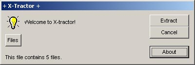



## Self Extractor \!\!\! Like WinZip but with no compression\.

### Description

This file gets many files and adds them to ONLY one file!!! It looks like WinZip Self Extractor!! Please vote no matter bad it is! I need to know how good I am on these:) Report any bad bugs! I give this code to anyone who wants to continue this program! Don't lose it! :-)
 
### More Info
 

             |
---                |---
**Submitted On**   |1999-10-30 02:14:42
**By**             |[vasilakis](https://github.com/Planet-Source-Code/PSCIndex/blob/master/ByAuthor/vasilakis.md)
**Level**          |Intermediate
**User Rating**    |4.8 (110 globes from 23 users)
**Compatibility**  |VB 3\.0, VB 4\.0 \(16\-bit\), VB 4\.0 \(32\-bit\), VB 5\.0, VB 6\.0, VB Script, ASP \(Active Server Pages\) 
**Category**       |[Miscellaneous](https://github.com/Planet-Source-Code/PSCIndex/blob/master/ByCategory/miscellaneous__1-1.md)
**World**          |[Visual Basic](https://github.com/Planet-Source-Code/PSCIndex/blob/master/ByWorld/visual-basic.md)
**Archive File**   |[CODE\_UPLOAD71066242000\.zip](https://github.com/Planet-Source-Code/vasilakis-self-extractor-like-winzip-but-with-no-compression__1-9228/archive/master.zip)

### API Declarations

Don't forget to vote :-)

